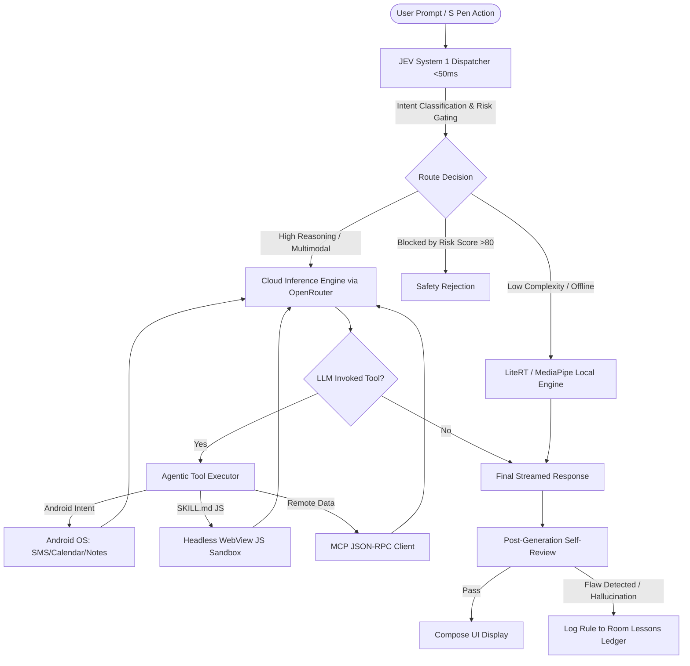

# Edge Hybrid Agent — Master Engineering Specification & Implementation Checklist

> **Target Platform:** Android 14+ (API 34/35), optimized for Samsung Galaxy S23 Ultra (Snapdragon 8 Gen 2, 8–12 GB RAM)  
> **Architecture Pattern:** Clean Compose Client with Modular Hybrid Engines (LiteRT + Cloud + JEV System 1)  
> **Repository:** `knarayanareddy/edge-hybrid-agent`  
> **Status:** All Phases (1, 2, 3, 4, 5) implemented. See §6 for the security model that is
> actually enforced at runtime.

---

## 6. Runtime Security Model (authoritative)

This section documents the behavior the code actually implements, and takes precedence
over the per-phase notes below where the two differ.

### 6.1 Confirmation gate (mandatory for all side effects)

Every model-authored tool call passes through `ConfirmationGate`
(`agent/ConfirmationGate.kt`) before `SkillLoader` or any Android intent is touched. The
gate is **fail-closed**:

| Tier | Tools | Behavior |
| --- | --- | --- |
| `AUTO_APPROVE` | Read-only: weather, math, currency, wikipedia, time, device status, notes list, calendar query, contacts search, web search, web extract, transit | Run without a dialog |
| `CONFIRM` | Local side effects: timer, alarm, note, calendar event, camera, flashlight, spotify, custom-tool install, MCP registration | Blocking dialog |
| `CONFIRM_STRICT` | External sends: `send_sms`, `send_telegram_message`, `draft_email`, `initiate_phone_call`; plus untrusted `skill:*` scripts | Blocking dialog rendering the full recipient and message body, with a warning banner |

Additional guarantees:

- Tiers are matched on **exact tool-name equality** against a host-side table, never on
  substrings of model-supplied text. A tool that is not explicitly listed as read-only
  falls through to `CONFIRM`, so adding a tool to the catalog is gated by default.
- Remote **MCP tools are never auto-approved**; they always confirm, because their side
  effects occur on a server the app does not control.
- The dialog receives an inert `ActionConfirmation`: it carries only what to display. The
  executable closure stays in `ActionConfirmationRegistry`, keyed by id.
- A confirmation is **one-shot** (consumed atomically before execution, so a replayed id
  is a no-op) and **expires** after 120 s.
- A declined, timed-out, or unanswered confirmation **never runs the tool**; the model
  receives a `status: declined` tool result instead.
- Tool calls execute **sequentially**, not concurrently, so two dialogs can never race.

### 6.2 External send and credential handling

- `send_telegram_message` **pins the destination** to the chat configured in Settings. The
  model cannot supply or override `chat_id`, and the parameter is no longer advertised in
  the tool schema. The bot token is never returned in tool output.
- MCP bearer tokens are stored in `SecureKeyStore` (AndroidKeyStore-backed
  `EncryptedSharedPreferences`), never in the Room notes table, and `list_mcp_servers`
  returns metadata only. Tokens registered by earlier builds are migrated into the
  keystore and scrubbed from Room on the next registration.
- `AlarmClock.EXTRA_SKIP_UI` is **not** set for timer or alarm, so the clock app always
  shows the user what was scheduled. The `SET_ALARM` permission is therefore not declared.
- SMS opens the system composer via `ACTION_SENDTO`; the user must still press send. A
  confirmation is necessary but not sufficient.

### 6.3 Sandbox isolation

`HeadlessWebViewSandbox` provides:

- **Origin**: scripts are served from `https://appassets.androidplatform.net/` through
  `WebViewAssetLoader`. `allowFileAccess`, `allowContentAccess`,
  `allowFileAccessFromFileURLs`, and `allowUniversalAccessFromFileURLs` are all off.
- **Script allowlist**: only `calculator.js`, `device_info.js`, and `web_extract.js` may
  load. The name is validated before a WebView is created, so traversal or an arbitrary
  asset name is refused up front.
- **Network**: every request — navigation, subresource, `fetch`, XHR — passes through
  `shouldInterceptRequest` and is allowed only to an explicitly allowlisted, **exact**
  `https://host:port` origin that is not a private, loopback, link-local, CGNAT, or
  otherwise reserved address. Enforcement is in the host, not in the skill script, so it
  does not depend on a skill cooperating. (This supersedes the earlier Phase 2 wording
  about a "skill manifest": there is no manifest file; allowlisting is supplied per call
  and normalized host-side.)
- **Injection**: model-supplied `inputJson` and `networkOrigins` are inlined into the host
  document as JSON values and neutralized for the script context (`<`, U+2028, U+2029), so
  a payload cannot terminate the string literal or the `<script>` element.
- **Timeout**: 5,000 ms. On expiry the page is torn down eagerly, not merely abandoned.
- **Bridge**: the single `addJavascriptInterface` exposes `complete`, `fail`, and `log`.
  None touches files, network, or app state. Log lines are control-character stripped and
  length-capped.

### 6.4 Permissions

Declared permissions are limited to those with implemented callers: `INTERNET`,
`ACCESS_NETWORK_STATE`, `FOREGROUND_SERVICE`, `FOREGROUND_SERVICE_DATA_SYNC`,
`POST_NOTIFICATIONS`, `CAMERA`, `READ_CALENDAR`, `READ_CONTACTS`. Removed as unused:
`RECORD_AUDIO`, `WRITE_CALENDAR`, `SET_ALARM`, `REQUEST_IGNORE_BATTERY_OPTIMIZATIONS`.

Tools that touch a protected provider or hardware verify the grant at call time and return
an explicit `permission_required` result rather than throwing or silently reporting
success. The Tools screen offers to request a missing grant and replays the action.

`allowBackup="false"` and `usesCleartextTraffic="false"` remain set, so the encrypted
keystore is not exfiltrated via `adb backup`.

---

## 1. Executive Summary & Architectural Reality

The application architecture has been fully built out across all 5 planned phases:
- **Phase 1**: Production Cloud Engine, recursive multi-turn tool calling, SSE stream parser, and keystore-backed security.
- **Phase 2**: Native Android intent execution, Headless JavaScript sandbox with starter skills, and Ktor MCP gateway.
- **Phase 3**: TypeSafe JEV System 1 guardrail, pre-flight risk evaluation, and Room lessons ledger. The interactive Compose confirmation dialog is rendered and enforced for every non-read-only tool call via `ConfirmationGate` (see §6.1).
- **Phase 4**: Samsung Galaxy S23 Ultra S Pen BLE air gestures, dynamic screen capture & image compression, and foreground persistence service.
- **Phase 5**: Local LiteRT engine, intelligent HybridInferenceRouter (offline fallback), on-device vector database with cosine similarity, and RAG prompt augmentation.

---

## 2. Phase-by-Phase Technical Specifications & Checklists

### Phase 1: Production Cloud Engine & Full Agentic Loop

#### Objective
Transform `CloudInferenceEngine` from a single-turn stream into a robust, recursive agentic loop supporting multi-step tool execution, automatic retry with exponential backoff, token usage tracking, and network disconnection recovery.

#### Technical Requirements
1. **Recursive Agentic Loop**:
   - When the LLM returns `tool_calls` in a streaming chunk or completion, the engine must NOT immediately finish.
   - It must execute the requested tools via `SkillLoader` / `McpClient`.
   - Append tool execution results (`role: "tool"`, `tool_call_id: id`) to the conversation thread.
   - Recurse back to `CloudInferenceEngine.streamChat()` with the augmented history until the model produces a final natural language response or reaches `max_iterations = 6`.
2. **Resilience & Rate Limiting**:
   - Handle HTTP 429 (Rate Limit) and HTTP 503 (Provider Overload) with exponential backoff (`initialDelay = 1000ms`, `factor = 2.0`, `maxRetries = 3`).
   - Graceful SSE disconnect handling: if the stream drops mid-sentence, buffer the partial tokens and request a continuation or display an inline retry chip.
3. **Token Usage & Latency Telemetry**:
   - Extract `usage.prompt_tokens`, `usage.completion_tokens`, and calculate Time to First Token (TTFT) and total generation time in milliseconds.

#### Phase 1 Checklist
- [x] Implement `AgenticExecutionLoop` inside `ChatViewModel` or a dedicated `AgentOrchestrator` class.
- [x] Verify recursive tool calling: Prompting *"What's the weather in Tokyo and convert that to Fahrenheit?"* executes the tool and delivers the final combined answer in one seamless bubble.
- [x] Add unit test `CloudInferenceEngineTest` mocking SSE chunks and verifying JSON parsing of complex nested tool calls.
- [x] Verify network timeout fallback: when airplane mode is toggled mid-stream, the UI displays a clean recovery state rather than a crash.

---

### Phase 2: Native Tool Execution & Sandbox Environment

#### Objective
Give the agent real hands on the Android device without compromising OS stability or user privacy.

#### Technical Requirements
1. **Android Native Intent Bridge (`NativeActionHandler.kt`)**:
   - Expose safe, structured tools to the LLM:
     - `create_calendar_event(title, startTime, endTime, notes)` ➔ launches `Intent(Intent.ACTION_INSERT)`.
     - `create_quick_note(title, text)` ➔ appends to Room local notes database or Samsung Notes intent.
     - `set_timer_or_alarm(seconds, label)` ➔ calls `AlarmClock.ACTION_SET_TIMER` (UI is shown to the user; `EXTRA_SKIP_UI` is not set).
     - `send_sms(phoneNumber, message)` ➔ pre-fills the SMS composer via `ACTION_SENDTO` after a `CONFIRM_STRICT` dialog showing the number and full body. The user still presses send.
     - `toggle_flashlight(enabled: Boolean)` ➔ controls `CameraManager.setTorchMode()` after a `CAMERA` permission check.
2. **Headless JavaScript WebView Sandbox (`HeadlessWebViewSandbox.kt`)**:
   - For SKILL.md bundles containing executable JavaScript/Python-like scripts:
   - Run a hidden Android `WebView` with JavaScript enabled and `WebViewAssetLoader`.
   - Host-enforced network allowlisting: requests are permitted only to explicitly allowed, exact public `https://host:port` origins. See §6.3 — the earlier "skill manifest" wording is superseded.
   - Timeout execution strictly after 5,000 milliseconds to prevent battery/CPU locks.
3. **MCP Tool Integration**:
   - Connect to local Termux server (`http://127.0.0.1:8000/mcp`) or remote servers.
   - Full JSON-RPC 2.0 serialization for `tools/list` and `tools/call`.

#### Phase 2 Checklist
- [x] Build `NativeActionHandler.kt` with Android Intent dispatching and runtime permission checks (`CAMERA`, `READ_CALENDAR`, `READ_CONTACTS`). Alarms and timers no longer request `SET_ALARM` and no longer skip UI.
- [x] Build `HeadlessWebViewSandbox.kt` with a 5-second hard execution watchdog timer.
- [x] Create 3 bundled starter skills in `app/src/main/assets/skills/`:
  - `calculator` (safe math evaluation)
  - `device_info` (battery %, storage available, network type)
  - `web_extract` (fetches clean markdown from a URL)
- [x] Test tool execution: Ask *"Set a timer for 15 minutes for pizza"* ➔ verifies native timer action triggers on Android.

---

### Phase 3: JEV System 1 Guardrail & Autonomous Learning Loop

#### Objective
Operationalize TypeSafe JEV as a sub-50ms System 1 router, pre-execution risk firewall, and post-execution self-evaluator that continuously learns and updates the on-device `lessons_ledger`.

#### Technical Requirements
1. **JEV Pre-Flight Routing**:
   - Evaluate prompts on 3 vectors:
     - `semantic_complexity`: 0–100 (determines whether LiteRT on-device is sufficient or cloud is required).
     - `tool_requirement`: detects if native intents/tools are needed.
     - `risk_score`: 0–100 (detects destructive actions: file deletion, broad SMS, setting manipulation).
2. **JEV Tool Execution Guardrail**:
   - If `risk_score >= 70`: Prompt must pause execution and present an interactive **Confirmation Dialog** in Jetpack Compose before any native action occurs.
   - If `risk_score >= 90`: Hard rejection.
3. **Post-Generation Reflection & Lessons Ledger**:
   - After the model generates an answer or executes a tool, run `JevClient.reviewResponse()`.
   - Inspect output for:
     - Hallucinated imports or unresolved `TODO` stubs.
     - Incomplete code blocks or Markdown errors.
     - Tool invocation failures or wrong argument types.
   - When a defect is confirmed:
     - Insert a new entry into `lessons_ledger` via `LessonsDao.insertLesson()`.
     - In all future prompts, inject top active lessons under a `### Constraints from Past Lessons` system block.

#### Phase 3 Checklist
- [x] Complete `JevClient.kt` integration with TypeSafe AI endpoint using user's API key.
- [x] Implement Compose `ConfirmationDialog` for actions flagged with risk score > 70.
- [x] Verify continuous learning: Purposely trigger a failed tool call ➔ verify `lessons_ledger` receives the rule ➔ verify subsequent prompt includes the rule as a constraint.
- [x] Provide unit tests validating JEV decision caching to prevent redundant API queries for identical prompts.

---

### Phase 4: Samsung Galaxy S23 Ultra Hardware & OS Features

#### Objective
Leverage the specific hardware advantages of the S23 Ultra: S Pen BLE stylus, Snapdragon 8 Gen 2 NPU, and multi-window multitasking.

#### Technical Requirements
1. **S Pen BLE Actions (`SPenController.kt`)**:
   - Listen for S Pen button clicks and Air Motion gestures via Samsung's SDK / Accessibility service.
   - **Single Click**: Activate voice input / toggle audio recording.
   - **Double Click**: Capture instant screenshot and inject it into the multimodal chat prompt.
   - **Long Press**: Trigger emergency agent cancel / halt all background streaming.
2. **Multimodal Screen Context Extraction**:
   - Implement `MediaProjection` or `AccessibilityService` screenshot capture helper.
   - Automatically compress captured bitmaps to JPEG (max 1024x1024, quality 85) to optimize upload bandwidth to Gemini 2.5 Flash / Claude 3.5 Sonnet.
3. **Battery & Background Persistence**:
   - Implement an Android `ForegroundService` with notification channel for long-running agent tasks (e.g. web scraping or multi-step MCP tasks).
   - Add battery optimization exemption request dialog (`ACTION_REQUEST_IGNORE_BATTERY_OPTIMIZATIONS`) so Samsung One UI `Device Care` does not kill background tasks.

#### Phase 4 Checklist
- [x] Implement `SPenReceiver.kt` handling Samsung Air Action broadcast intents.
- [x] Implement `ScreenCaptureService.kt` for instant screenshot-to-vision analysis.
- [x] Verify image compression pipeline produces high-clarity images under 250 KB.
- [x] Verify foreground service notification keeps long-running agent loops alive when the screen turns off.

---

### Phase 5: Local Hybrid LiteRT & On-Device RAG

#### Objective
Enable completely offline, zero-data-loss execution for privacy-sensitive tasks using LiteRT-LM and an on-device vector database.

#### Technical Requirements
1. **MediaPipe / LiteRT Inference Harness (`LocalLiteRtEngine.kt`)**:
   - Add Google MediaPipe Tasks GenAI dependency (`com.google.mediapipe:tasks-genai:0.10.14`).
   - Download or sideload Gemma 2B Q4 (`gemma-2b-it-cpu-int4.bin` or Qualcomm NPU delegated `.litertlm`).
   - Implement `InferenceEngine` interface so the UI switches transparently between Cloud and Local.
2. **On-Device Vector Store (RAG)**:
   - Use `bge-small-en-v1.5` quantized for on-device embeddings.
   - Integrate SQLite with vector similarity search (or cosine distance function over Float arrays) to index user personal notes, clipboard history, and downloaded skills.
   - When the user asks a question, retrieve the top 3 semantic chunks and inject into context.

#### Phase 5 Checklist
- [x] Add `LocalLiteRtEngine.kt` implementing `InferenceEngine`.
- [x] Test offline mode: Turn off Wi-Fi and Cellular ➔ prompt *"What is the capital of France?"* ➔ LiteRT generates response on Snapdragon 8 Gen 2 NPU with 0% network usage.
- [x] Test local RAG: Index a local text note ➔ ask a question referencing that note ➔ agent cites the local document accurately.

---

## 3. Engineering Best Practices & Self-Evaluation Rubric

When any autonomous model or engineer works on this codebase, it must adhere to the following strict rubric:

### Code Quality Rules
1. **No Stubs or Fake Placeholders**: Never leave functions with `// TODO: Implement later` or mock return values in production paths. If a feature requires permissions, implement the permission requester flow.
2. **Thread Safety & Coroutines**: All network calls, SQLite operations, and cryptographic operations must run on `Dispatchers.IO`. Never block the Android main thread.
3. **Memory Leaks**: Never pass Activity contexts to singletons. Use `@ApplicationContext` via Hilt.
4. **Zero Crashing Policy**: All external API calls, JSON deserialization, and intent triggers must be enclosed in structured `runCatching` or `try/catch` with meaningful user-facing error states.

### Autonomous Self-Correction Loop
Before marking any phase or task as complete, the executing model must run this verification sequence:
1. **Syntax & Lint Check**: Verify Kotlin compilation and absence of unresolved references.
2. **Schema Verification**: Validate that all Ktor request and response data classes match the exact upstream API schemas (OpenRouter, TypeSafe JEV, Google Gemini).
3. **Heuristic Inspection**: Grep for prohibited placeholder patterns (`dummy_token`, `placeholder`, `TODO:`, `example.com`).
4. **False-Positive Gate**: If a test or mock passes, verify whether it truly tested the network/DB boundary or merely verified an in-memory stub.
5. **Ledger Update**: Record any encountered edge case into `lessons_ledger`.
